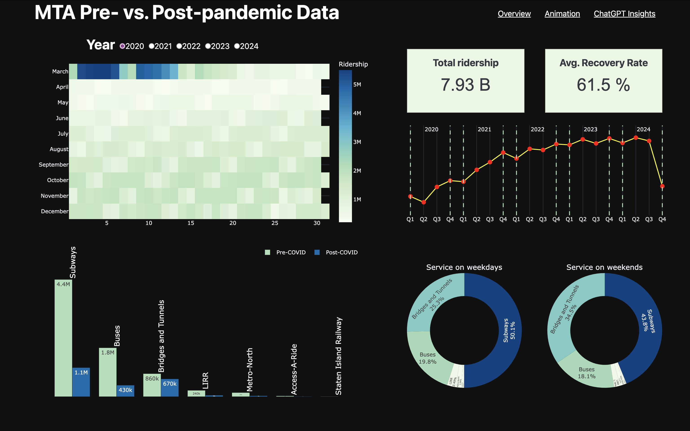
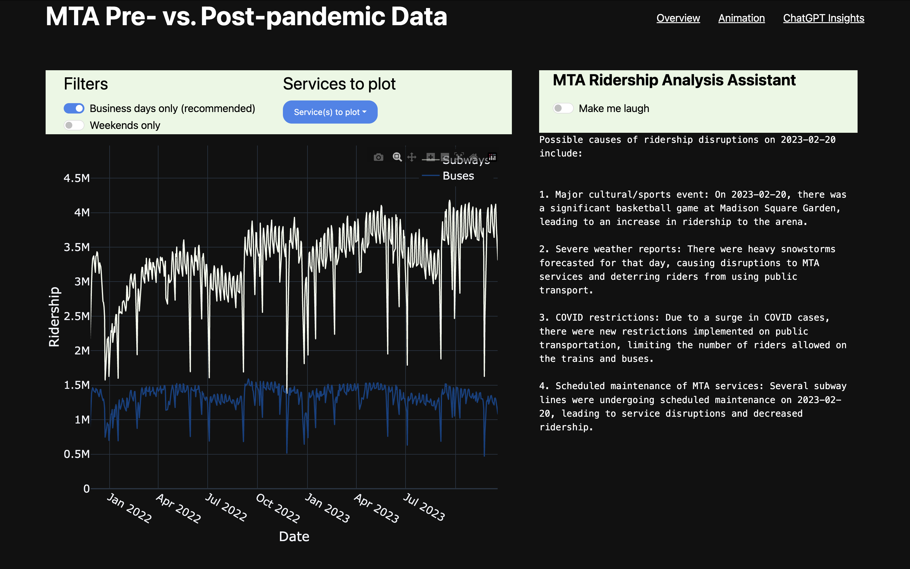

# Submission for Plotly Holiday Challenge, in colba with Maven Analytics

This is my submission for the Holiday Dash App Challenge.
The app can be accessed at [this link](https://mta-data-challenge-2328e0a413db.herokuapp.com/)

It is a multi-page app:

1. Overview page featuring simple plots that can be filtered by year
2. Animation page featuring an animated stacked line plot with a live net change tracker and a couple of filters
3. Insights page where the user can hover over a data point (i.e. date) to query ChatGPT for some insights regarding what might have disturbed the MTA ridership on that specific day

For performance, the app makes use of Flask Caching as the animation quickly consumes a lot of ressources.

Below are some screencaptures:

